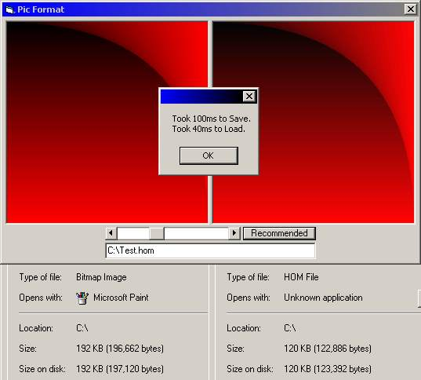



## Homicidal Picture Format

### Description

This is my own picture format. It is able to compress pictures by limiting how many colors are used. It can save in 100ms and load in 40ms. This shows you how to edit a picture fast and read/write to a file bit by bit.
 
### More Info
 

             |
---                |---
**Submitted On**   |2002-08-14 00:33:18
**By**             |[Sc00bz](https://github.com/Planet-Source-Code/PSCIndex/blob/master/ByAuthor/sc00bz.md)
**Level**          |Intermediate
**User Rating**    |4.3 (26 globes from 6 users)
**Compatibility**  |VB 6\.0
**Category**       |[Graphics](https://github.com/Planet-Source-Code/PSCIndex/blob/master/ByCategory/graphics__1-46.md)
**World**          |[Visual Basic](https://github.com/Planet-Source-Code/PSCIndex/blob/master/ByWorld/visual-basic.md)
**Archive File**   |[Homicidal\_1178708142002\.zip](https://github.com/Planet-Source-Code/sc00bz-homicidal-picture-format__1-37933/archive/master.zip)

